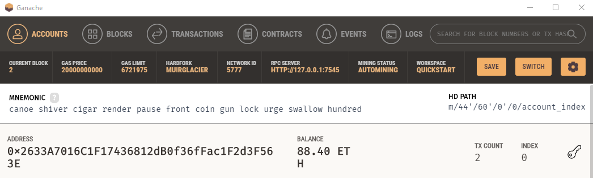
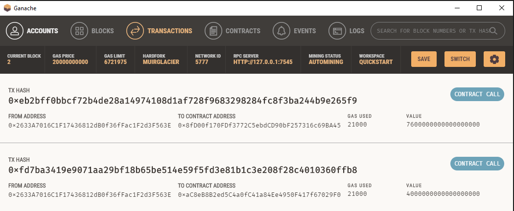
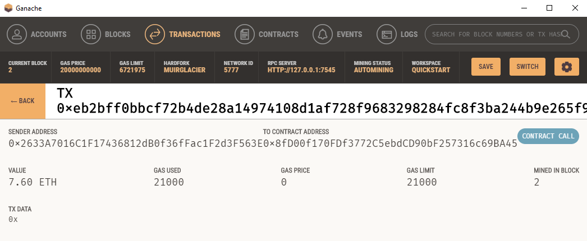

# Blockchain-Wallet-Challenge
The main task in this challenge is to deploy an Ethereum based job board that enables the customers to instantly pay their hired fintech professionals with cryptocurrency.

### Organization
The central python file is `krypto_jobs.py`. To run the file
1. Download the repository
2. Insure dependencies are installed, correct environment is activated, and navigate to the parent directory
3. Run a Ganache node on your local machine
3. In the command line, run `streamlit run krypto_jobs.py`

### Code and Dependencies
This code is to be run on `Python 3.7.13`
Requires the download and install of Ganache

The following Python Libraries were also imported and used:

- streamlit
- dataclasses 
- typing 
- os
- requests
- dotenv 
- web3 

## Objectives
- Import Ethereum Transaction Functions into the KryptoJobs Application
- Sign and Run a Payment Transaction
- Inspect the Transaction in Ganache

## Results and Data Story
The result was a successfully deployed application.

Here is the address balance and history in Ganache.
[Repo Link](https://github.com/bweilers/Blockchain-wallet/)  

As you can see, here are the transaction details for the address referenced in the above image.
[Repo Link](https://github.com/bweilers/Blockchain-wallet/)  

Here is where the Eth was sent.
[Repo Link](https://github.com/bweilers/Blockchain-wallet/)  

Here is the result of the app displayed on the streamlit interface. Note that the sender address, to contract address, and amounts all align.
[Repo Link](https://github.com/bweilers/Blockchain-wallet/)  

